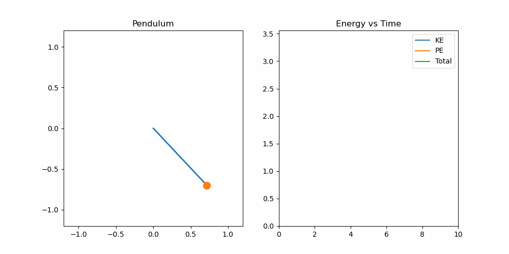

# 🔬 Damped Pendulum Simulation (Python)


---

## 📌 Overview
This project simulates the motion of a **damped pendulum** using numerical methods and visualizes both motion and energy changes in real time.

---

## 🎯 Features
- 🎥 Real-time pendulum animation  
- ⚡ Kinetic Energy (KE), Potential Energy (PE), and Total Energy plots  
- 🌫️ Damping effect (energy loss over time)  
- 📐 Non-linear system (no small-angle approximation)  

---

## ⚙️ Physics Model

The system follows the differential equation:

**θ'' + bθ' + (g/L) sin(θ) = 0**

---

## 🎥 Demo



---

## 🛠️ Tech Stack

- Python  
- NumPy  
- Matplotlib  

---

## 🚀 How to Run

```bash
pip install -r requirements.txt
python pendulum.py