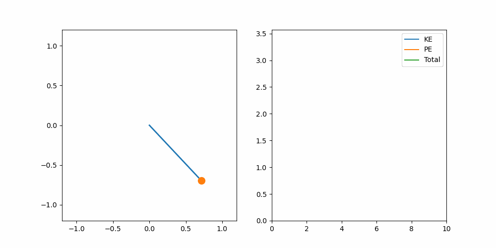

# 🔬 Damped Pendulum Simulation (Python)


---

## 📌 Overview
This project simulates the motion of a **damped pendulum** using numerical methods and visualizes both motion and energy changes in real time.

---

## 🎯 Features
- 🎥 Real-time pendulum animation  
- ⚡ Kinetic Energy (KE), Potential Energy (PE), and Total Energy plots  
- 🌫️ Damping effect (energy loss over time)  
- 📐 Non-linear system (no small-angle approximation)
- 🔬 Multiple numerical methods (Euler & RK4)

---

## ⚙️ Physics Model

The system follows the differential equation:

**θ'' + bθ' + (g/L) sin(θ) = 0**

---

## 🔬 Numerical Methods

This project implements two methods:

### Euler Method
- Simple and easy to implement  
- Less accurate for non-linear systems  

### Runge-Kutta 4th Order (RK4)
- Higher accuracy and stability  
- Better for solving differential equations

---

## ⚖️ Euler vs RK4 Comparison

| Method | Accuracy | Stability   |
|--------|----------|-------------|
| Euler  | Low      | Less stable |
| RK4    | High     | More stable |

---

### 📊 Observation
RK4 produces smoother motion and more accurate energy behavior compared to Euler.

---

## 🎥 Demo

### Euler Method


### RK4 Method


---

## 📊 Results & Observations

- Energy decreases over time due to damping  
- RK4 maintains better numerical stability than Euler  
- System eventually comes to rest

---

## 🛠️ Tech Stack

- Python  
- NumPy  
- Matplotlib  

---

## 🚀 How to Run

```bash
pip install -r requirements.txt
python pendulum.py
